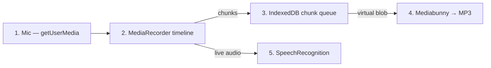

# Architecture overview

A Vite + React single-page app that visualizes its own recording pipeline as a `react-flow` graph. Recording is a from-scratch `getUserMedia` + `MediaRecorder` implementation; preview is a plain `<audio>` element; encoding is offloaded to a Web Worker. There is no waveform engine.

## Pipeline



Each numbered node is a `react-flow` node component under `src/components/flow/` that exposes its controls and live state inline. Edges animate while data is flowing.

## Two views

- **Session library** (`src/components/SessionLibrary/`) — initial screen. Lists past takes (drafts shown with a `draft` badge), opens or deletes them, starts a fresh recording. Drives `?session=<id>` (or `?session=new`) URL params with `pushState` so back/forward and refresh restore the right view.
- **Pipeline flow** (`src/components/flow/PipelineFlow.tsx`) — the recorder. Mounted with either `initialSession=null` (fresh take) or a `LoadedSession` carrying its blob + transcript so the audio preview and transcription node light up immediately.

## Result-based core

Every async/IO surface returns `Result<T, AppError>` from `src/lib/result.ts`. Callers branch on `result.ok` instead of `try/catch`. `AppError` carries a structured `code` (`unsupported`, `permission-denied`, `not-found`, `in-use`, `aborted`, `invalid-state`, `storage`, `encoding`, `speech`, `unknown`) plus `message` and an optional `cause`.

| Module | Responsibility |
| --- | --- |
| `src/services/micService.ts` | `listMicrophones`, `requestMicrophoneStream`, `stopStream`. Wraps `navigator.mediaDevices` and classifies platform errors into `AppError`. |
| `src/services/mediaRecorderService.ts` | `startMediaRecorder` builds a `RecorderHandle` whose `pause/resume/stop` each return a `Result`. Picks the best supported MIME type and emits 5 s timesliced chunks. |
| `src/lib/db.ts` | Single IndexedDB database (`recording-sessions`) with two stores: `sessions` (metadata) and `chunks` (blob rows indexed by `sessionId`). Chunks are the source of truth — no separate finalized-blob store. |
| `src/services/audioExportService.ts` | `encodeMp3` posts the recorded blob to a Web Worker that runs Mediabunny + `@mediabunny/mp3-encoder` and returns a `Result<Blob, AppError>`. |
| `src/services/speechRecognitionService.ts` | `startLiveTranscription` spawns the browser `SpeechRecognition`, restarts it on natural ends, and surfaces partial / final / error events. |

## Storage model

```
recording-sessions (IndexedDB, v3)
├── sessions            keyPath: id           index: createdAt
│     SessionMeta { id, title, createdAt, updatedAt,
│                   durationMs, size, mimeType,
│                   transcript[], finalized }
└── chunks              keyPath: id           index: sessionId, sequence, createdAt
      StoredChunk { id, sessionId, sequence,
                    createdAt, size, type, blob }
```

- A session row is created when recording starts (`finalized: false`) and updated when stop fires (`finalized: true` plus duration/size/mime/transcript).
- Each `MediaRecorder.ondataavailable` writes one chunk row tagged with the active `sessionId`.
- **Chunks are never cleared on export.** They are the canonical bytes for the take.
- `loadSession(id)` reads the metadata, fetches all chunks via the `sessionId` index, and builds a virtual `new Blob([...chunks])` (reference-concat — the browser does not copy bytes). Mediabunny reads ranges of that blob inside the worker.
- `deleteSession(id)` runs one transaction across both stores so metadata + chunks are removed atomically.

### Crash recovery

`reconcileSessions()` runs on app mount and handles two anomalies in one pass:

- **Orphan chunks** — chunks whose `sessionId` has no matching session row. Promoted into a draft session titled `Recovered recording — {timestamp}`.
- **Empty drafts** — sessions with `finalized: false` and zero chunks. Deleted as failed-start residue.

This means a tab crash mid-recording becomes "the take shows up in the library on next visit," limited only by the `MediaRecorder` timeslice (5 s today, so up to ~5 s of trailing buffer is lost).

## Orchestration

`src/hooks/usePipeline.ts` is a thin composer over four sub-hooks. Each owns one slice of state — most use a `useReducer` so the related transitions live in one switch instead of being spread across many `setState` calls.

| Hook | State | Reducer? |
| --- | --- | --- |
| `useMicDevices` | device list, selected device, processing toggles, mic error, permission flag, internal stream ref | yes |
| `useRecorder` | recorder status, mime type, elapsed time, queue chunks/bytes/recent events, final blob + object URL, recorder error | yes |
| `useTranscription` | transcript segments, current partial, active flag, transcription error | yes |
| `useMp3Export` | MP3 settings, export progress, isExporting, export error | yes |

`usePipeline` itself holds no `useState` — it just wires the sub-hooks together and re-exposes a flat `state` / `actions` shape so the flow nodes do not need to know about the split.

Cross-slice handoffs:
- `startRecording` calls `mic.acquireStream()`, creates the draft session row, calls `recorder.start({ stream, sessionId, onStop })`, then `transcription.begin()`. The `onStop` callback flushes any in-flight partial transcript to a final segment, tears down transcription, releases the stream, and fires `onTakeFinalized` with the assembled blob + sessionId + transcript.
- `pauseRecording` / `resumeRecording` toggle `recorder` and `transcription` together so the live transcript engine matches the recorder lifecycle.
- `exportMp3` reads `recorder.finalBlob` + `recorder.elapsedMs` and hands them to `useMp3Export`.

`usePipeline` accepts `{ initialSession?: LoadedSession; onTakeFinalized?: (take) => void }`. When `initialSession` is provided the recorder slice seeds preview state and pulls the queue snapshot, and the transcription slice seeds its segment list.

## App routing & URL params

`App.tsx` is the view switch:

| URL | View |
| --- | --- |
| (none) | Session library |
| `?session=new` | Fresh `PipelineFlow` |
| `?session=<id>` | `PipelineFlow` opened on `<id>` (404 falls back to library) |

- `pushState` for user-initiated nav (open/back/new), `replaceState` after a fresh take is finalized so a refresh restores the just-recorded take instead of restarting blank.
- `popstate` is wired so browser back/forward replays the corresponding view.

## File layout

```
src/
  App.tsx                       # view switch + URL sync
  main.tsx                      # ErrorBoundary + StrictMode
  styles.css                    # paper / ink theme variables
  types.ts                      # RecordingStatus, TranscriptSegment
  lib/
    result.ts                   # Result<T, E>, AppError, helpers
    db.ts                       # sessions + chunks (Result-based)
    audio.ts                    # formatDuration, formatBytes, downloadBlob
  services/
    micService.ts
    mediaRecorderService.ts
    audioExportService.ts
    mp3EncoderCore.ts           # Mp3ExportSettings, defaults
    speechRecognitionService.ts
  hooks/
    usePipeline.ts              # composer: wires the four slices below
    useMicDevices.ts            # device enumeration + stream lifecycle
    useRecorder.ts              # MediaRecorder + timer + chunk queue + final blob
    useTranscription.ts         # SpeechRecognition wrapper + segments
    useMp3Export.ts             # encoder settings + export action
  components/
    ErrorBoundary/
    SessionLibrary/             # initial library view
    flow/
      PipelineFlow.tsx          # nodes + edges + ReactFlow shell
      MicNode.tsx
      RecorderNode.tsx
      QueueNode.tsx
      ExportNode.tsx
      TranscriptionNode.tsx
      nodeStyles.module.css
  workers/mp3Encoder.worker.ts
  test/                         # Vitest suites
```

## Tooling

- Vite 7 + React 19, TypeScript strict (incl. `exactOptionalPropertyTypes`, `noUncheckedIndexedAccess`).
- `@xyflow/react` 12 for the flow chart, `mediabunny` + `@mediabunny/mp3-encoder` for export.
- ESLint with `typescript-eslint` and the React Compiler hooks plugin.
- Vitest + `fake-indexeddb` for the storage tests.
- `make install`, `make run`, `make build`, `make test`, `make typecheck` wrap the Yarn scripts.
