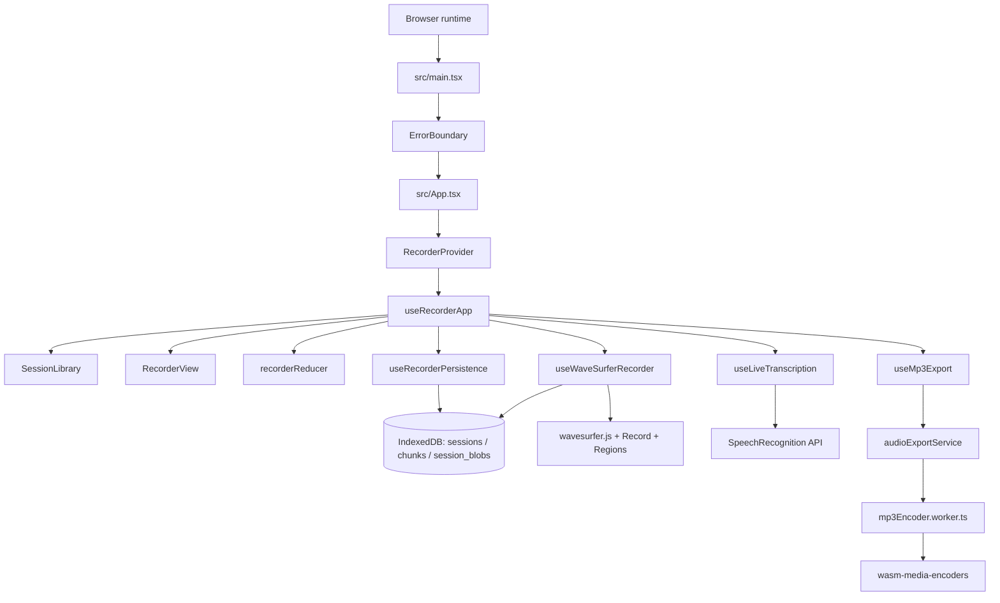
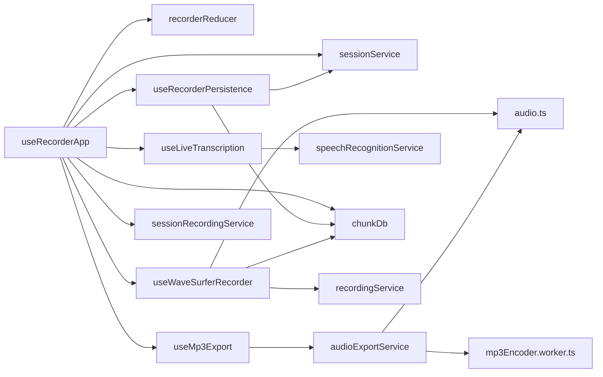
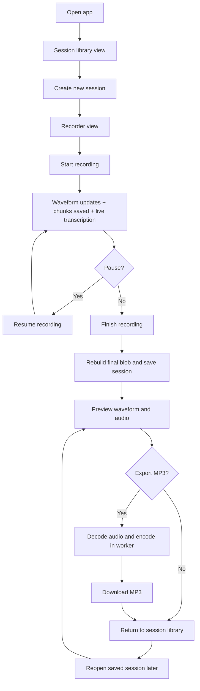

# Architecture overview

This app is a Vite + React single-page recorder for `wavesurfer.js`'s Record plugin. It keeps session metadata and recorded media in IndexedDB, renders the live waveform in the browser, exports finalized takes to MP3 in a Web Worker, and optionally overlays speech-to-text transcript regions on the waveform.

## High-level flow

## Hook and service wiring

`useRecorderApp` is the coordinator: it composes the other hooks, bridges reducer actions to persistence and waveform side effects, and calls session services for session creation, reopening, reset, and finalization.

## Runtime overview

1. `src/main.tsx` mounts the app inside `StrictMode` and wraps it in `ErrorBoundary`.
2. `src/App.tsx` creates the recorder context with `RecorderProvider`, then switches between the session library and active recorder shell.
3. `src/hooks/useRecorderApp.ts` is the main orchestration hook. It owns the reducer-driven UI state, session lifecycle, queue stats, waveform control, MP3 export state, and live transcription state.
4. `src/hooks/useWaveSurferRecorder.ts` creates the `wavesurfer.js` instance plus Record and Regions plugins, listens to record lifecycle events, persists chunked audio, and reloads finalized audio for preview.
5. `src/hooks/useRecorderPersistence.ts` synchronizes reducer state with IndexedDB-backed session metadata, stored blobs, and chunk statistics.

## Module boundaries

| Area | Responsibility | Key files |
| --- | --- | --- |
| App shell | Mount the provider and choose between session list and recorder UI | `src/main.tsx`, `src/App.tsx` |
| Context + orchestration | Expose the recorder API to components and coordinate the major hooks | `src/context/*`, `src/hooks/useRecorderApp.ts` |
| UI components | Render the session library, recorder controls, export controls, and error states | `src/components/**` |
| State | Define the reducer, actions, and defaults for recorder UI state | `src/state/recorderReducer.ts` |
| Persistence | Store sessions, chunks, queue stats, and finalized blobs in IndexedDB | `src/lib/chunkDb.ts`, `src/hooks/useRecorderPersistence.ts` |
| Recording services | Shape sessions, rebuild blobs from cached chunks, and prepare/finalize recordings | `src/services/sessionService.ts`, `src/services/sessionRecordingService.ts`, `src/services/recordingService.ts` |
| Export pipeline | Decode recorded audio and hand PCM buffers to the MP3 encoder worker | `src/services/audioExportService.ts`, `src/services/mp3EncoderCore.ts`, `src/workers/mp3Encoder.worker.ts` |
| Transcription | Integrate browser speech recognition and turn phrases into timed waveform regions | `src/hooks/useLiveTranscription.ts`, `src/services/speechRecognitionService.ts` |

## Recording and persistence flow

1. Creating a session stores draft metadata in IndexedDB and switches the UI into recorder mode.
2. Starting recording configures microphone processing options, starts `wavesurfer.js` recording, and enables live transcription.
3. Each `record-data-available` event is converted into a stored chunk and written into the `chunks` object store. Queue statistics and per-session chunk metadata are refreshed after each successful write.
4. When recording ends, the app rebuilds a complete blob from cached chunks, stores the finalized blob in `session_blobs`, clears the temporary chunk queue for that session, and updates session metadata to `stopped`.
5. Reopening a session reloads either the finalized blob or a reconstructed in-progress blob and redraws transcript regions on the waveform.

## User flow (happy path)

## Data storage model

`src/lib/chunkDb.ts` manages one IndexedDB database named `field-recorder` with three stores:

- `sessions` stores `RecordingSession` metadata such as title, status, MIME type, duration, chunk count, and transcript data.
- `chunks` stores in-progress `StoredChunk` records keyed by chunk id and indexed by `sessionId`.
- `session_blobs` stores finalized blobs separately from metadata so completed recordings remain available without duplicating chunk data.

This split lets the app recover interrupted sessions, show queue statistics, and avoid keeping both the finalized blob and the full temporary chunk queue after a take is finished.

## Export and transcription details

- MP3 export is deliberately offloaded to `src/workers/mp3Encoder.worker.ts`. The main thread decodes the recorded blob to PCM, then transfers channel buffers to the worker for encoding with `wasm-media-encoders`.
- Live transcription depends on the browser `SpeechRecognition` / `webkitSpeechRecognition` API. Transcript segments are persisted on the session and rendered as non-editable waveform regions.
- Transcript timing is estimated from recorder elapsed time, so regions are useful for navigation and context rather than word-perfect alignment.

## Tooling

- **Package manager:** Yarn 1 (`packageManager` is pinned in `package.json`)
- **Dev server and bundling:** Vite with the React plugin
- **Type checking:** TypeScript in strict mode with `noUncheckedIndexedAccess` and `exactOptionalPropertyTypes`
- **Linting:** ESLint + `typescript-eslint`
- **Testing:** Vitest
- **CSS module typings:** `typed-css-modules`
- **Task runner:** The root `Makefile` wraps common Yarn workflows with `make install`, `make run`, and `make build`
